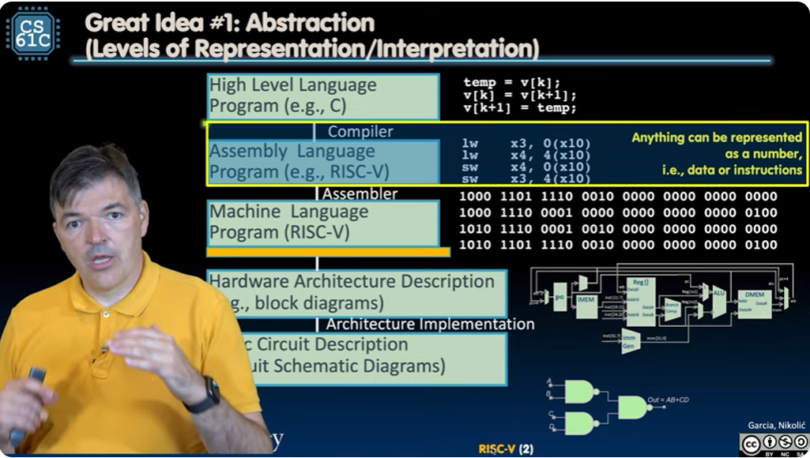

# RISC-V 入门

## 1. 什么是指令集



这个部分讲RISC-V 指令集架构及 RISC-V 汇编语言。

讲汇编语言时，是站在 CPU 执行指令的角度讲的，汇编语言编码指令。通常情况下，汇编代码由编译器生成。

指令像一个接一个的句子，说明：对什么（operands,或 objects）执行什么操作（operations）。

现在 CPU 每秒可执行 10 亿条指令，不同的 CPU 使用不同的指令集工作。

某类CPU实现的指令集叫指令集架构：
  - 如，ARM（手机）、Intel x86（i9, i7, i5, i3）、IBM Power、RISC-V 等

RISC-V 哲学：
  - 保持指令集包含的指令数量少且简单，能基于此造出更快的硬件；
  - 在软件层面通过组合简单指令实现复杂操作

## 2. 指令是对寄存器的操作

寄存器是计算机架构中的基本构成部分。


某个架构的指令集，就是该架构能够执行的指令的集合，由汇编语言表示，每一行汇编语言代码，表示一条给计算机执行的指令。汇编语言中没有变量。

汇编语言的操作数（operands）是 registers，registers 是直接造在处理器内部的数量有限的特殊部件，任何操作只能对 registers（中的数据） 展开。

汇编语言可直接操作寄存器，由于寄存器离执行单元(arithmetic logic unit, 算数逻辑单元)很近，所以读取一次极快，比 0.25ns 还快。
  - 光速是 3×10^8 m/s = 0.3m/ns = 30cm/ns = 10cm/0.3ns。而 0.3ns 是 3.33GHz 电脑的时钟周期

处理器拿着一个内存地址往内存中读、写数据。

RISC-V 架构有 32 个寄存器，每个寄存器的大小是 32 bits，32 bits 合起来叫一个 word
  - 编号为从 `x0` 到 `x31`
  - `x0` 寄存器很特殊，只保存 0 值，剩下31个寄存器存变量的值。
  - 可以给每个寄存器定义逻辑上的名称

汇编语言中的注释以 `#` 开头

## 3. 汇编语言的加、减指令

汇编语言的语法固定如以下格式：
```
one two, three, four
add x1, x2, x3
```
one: 操作符名称
two: 获取结果的操作数（destination, x1）
three: 1st operand for operation (source1, x2)
four: 2nd operand for operation (source2, x3)

如此固定的格式让硬件实现起来变得简单。

- 汇编语言中的加法：
  - eg: add x1,x2,x3 (in RISC-V)
  - 等同于: a = b + c (in C)
  - C 变量与 RISC-V 寄存器的隐射关系:
    a <=> x1, b <=> x2, c <=> x3

- 汇编语言中的减法：
  - eg: sub x3,x4,x5 (in RISC-V)
  - 等同于: d = e + f (in C)
  - C 变量与 RISC-V 寄存器的隐射关系:
    d <=> x3, e <=> x4, f <=> x5

遇到多个参数的 C 语句就要组合多个指令:
a = b + c + d - e;

用多条指令执行:
```
add x10, x1, x2  # temp = b + c
add x10, x10, x3  # temp = temp + d
sub x10, x10, x4  # a = temp - e
```

## 4. 汇编语言中的常数：immediates

计算中常会涉及到常数，如 `a=b+10;`，这个10就是常数，常数在汇编语言中的常数叫 immediates, 涉及到 immediates 的加法用指令 `addi`，如

```
addi x1, x2, 10 # 对应 C语言中的 a=b+10
```

其语法为：
addi one, two, immediates
  - one 是 destination
  - two 是 source
  - immediates 常数

## 5. 汇编语言的操作符：内存地址

由于计算只能在寄存器中进行，所以涉及到大容量的数据结构（数组、结构体）的计算时，要先将把它们的数据载入到寄存器，再读取寄存器中的值进行运算。

当操作符是内存地址时，就要用数据转移指令(data transfer instruction)，
- 从内存载入数据到寄存器叫 load，指令为 lw（load word）
- 从寄存器复制数据到内存到 store, 指令为 sw（store word）

RISC-V 按字节寻址（每个字节有一个内存地址）。而 C 语言中数组的 index 表示字宽，在汇编中的 offset 需要乘以 4，例如将以下 C 语言代码编译为汇编代码：
```
A[12] = h + A[8]
# 假设数组 A 的 base address 位于 x22, h 位于 x21

lw x9, 32(x22) # 由于按字节寻址，要将数组的索引乘以 4
add x9, x9, x21
sw x9, 48(x22) # 将 h+A[8] 的结果保存到 A[12]
```


